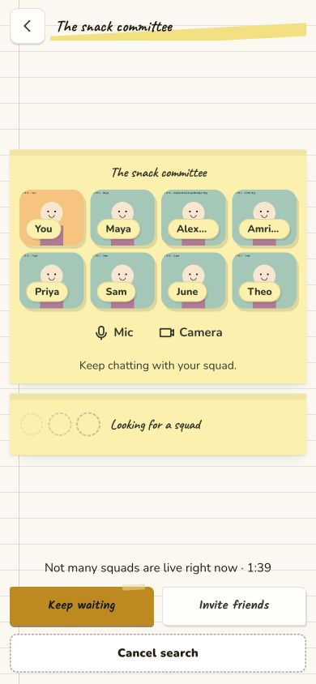

# Squad call continuity and layout QA

Checked on 7 October 2026, Asia/Kolkata. This change keeps a squad call owned above individual pages, retains capture and explicit device choices during channel transfers, shows live squad tiles during matchmaking, and gives shared dialogs a fixed header with a scrolling body. It also adds the [developer handover](../HANDOVER.md) and local setup script.

## Automated checks

| Check | Result |
| --- | --- |
| Agora SDK wrapper and shared call session | 42 tests passed |
| Desktop contracts and existing behavior checks | 185 tests passed |
| API tests with development Redis configuration | 451 tests passed |
| Desktop TypeScript | Passed |
| Next production build using production public URLs | Passed |
| Native TypeScript and Expo web export using a local public backend URL | Passed |
| Server deploy bundle | Healthy for 20 seconds after delayed startup jobs |
| Setup script in an isolated folder | Check-only, generated secrets, file permissions and existing-file preservation passed |
| Diff whitespace | Passed |

The server suite needs Redis: its unconfigured run had six Redis-dependent failures. Loading the development Redis settings alone resolved them. Loading the entire local environment changes policy-test assumptions through development access and feature flags, so it is unsuitable for this suite. Expo export requires an explicit public backend URL. Neither adjustment changes production configuration.

The setup fixture stubs dependency installation; the actual workspace separately passed `pnpm install --frozen-lockfile`. Generated JWT and auth-exchange secrets were 32 random bytes each, stored in mode-0600 environment files, absent from output, and preserved on rerun. Existing environment files were unchanged.

## Browser call flow

The real protected lobby, search, match and encounter pages ran on an isolated local origin with synthetic accounts, API responses and a stand-in Agora SDK. No production user data or physical devices were used. The temporary fixture route and overrides were removed before the production build.

| Step | Joint capture requests | Single capture requests | Channel joins | Channel leaves | Closed tracks | Device choices |
| --- | ---: | ---: | ---: | ---: | ---: | --- |
| Explicitly start camera and mic in lobby | 1 | 0 | 1 | 0 | 0 | Audio on, camera on |
| Search, then turn camera off | 1 | 0 | 1 | 0 | 0 | Audio on, camera off |
| Accept match and enter encounter | 1 | 0 | 2 | 1 | 0 | Audio on, camera off |
| End encounter and return to squad | 1 | 0 | 3 | 2 | 0 | Audio on, camera off |
| Leave calling routes for Home | 1 | 0 | 3 | 3 | 2 | Both off |

Focused SDK tests additionally cover late permission results, replacement squads, failed tokens and joins, same-squad cancellation, late cleanup, stale remote subscriptions, token renewal and automatic connection recovery. Failed transfers restore the presence of a still-connected private call; failed fresh joins clear prepared presence. Successful encounter entry clears private-room presence before setting encounter presence, matching the server's coupled flags.

## Layout and keyboard checks

- Eight-member search layout at 390 × 844 and 360 × 640 across Scrapbook, Soft, Play, Paper and Clay: no horizontal page overflow; camera/mic controls and Cancel remained reachable. Cancel's lower edge was 830px and 626px respectively.
- Desktop search at 1280 × 800, with eight members and with two members in dark Scrapbook: visually inspected.
- Eight-member squad settings at 360 × 640 across all skins: no horizontal body overflow; Close remained at least 44 × 44px within the viewport. Four skins scrolled in the recorded batch. Clay was separately verified at 844 × 390 after its transition, with 390px of body scrolling and its header still visible.
- Paper's drawn dialog frame stayed fixed while the content scrolled. Long headings wrapped with room for handwriting ascenders and descenders.
- Shared invite dialog and the custom invite sheet were inspected at 390 × 844 after the modal body change.
- Shift-Tab from Close reached the last dialog action; Escape dismissed the dialog and restored focus to Squad settings.

Raw measurements: [390px search](2026-10-07-squad-calls/search-layouts.json), [360px search](2026-10-07-squad-calls/search-360-layouts.json), [dialog batch](2026-10-07-squad-calls/modal-body-layouts.json). The Clay batch's zero scroll reflects that initial attempt; its separate landscape verification is described above.

Additional screenshots: [dark desktop](2026-10-07-squad-calls/search-squad-desktop-dark.jpg), [Paper settings while scrolled](2026-10-07-squad-calls/settings-paper-phone.jpg).

## Remaining acceptance

Test two physical participants on a laptop and phone, including Safari/iOS, real Agora permissions, device startup timing, remote audio/video, camera LED release, token expiry and poor-network recovery. Channel transfer reuses capture but still needs a network handshake. This QA does not establish zero lag or certify every game, screen, skin variant or native media flow. Individual game playability remains in the separate Game Night repository.
