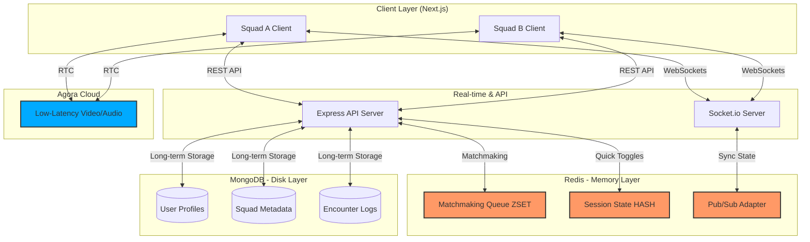
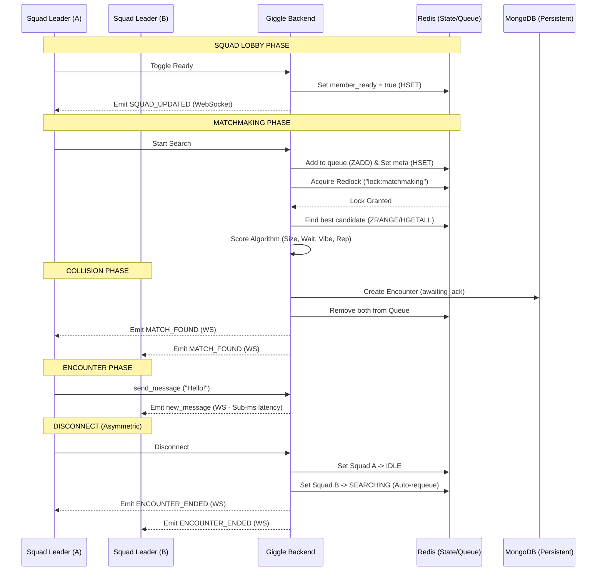

# Giggle Backend Architecture & Event Flow

This document provides a high-level overview of the Giggle backend architecture, detailing how real-time events, matchmaking, and session states are managed across our high-scale infrastructure.

---

## 1. System Architecture Diagram

## 2. Real-time Event Flow (Sequence)

---

## 3. Comprehensive User Actions & Backend Impact

| Action | Primary Trigger | Backend Logic | Data Layer Impact |
| :--- | :--- | :--- | :--- |
| **Create Squad** | REST POST | Generates 6-digit code, creates Leader identity. | **Mongo:** New Squad/Member docs. |
| **Ready Up** | REST POST | Updates live session state for friends to see. | **Redis:** Fast HSET update. |
| **Join Video** | Agora Sync | Updates video presence flag. | **Redis:** Fast HSET update. |
| **Start Search** | REST POST | Validates live Ready/Video states from Redis, enters queue. | **Redis:** Added to regional ZSET with timestamp score. |
| **Report Squad** | WebSocket | Triggers "Reputation Cascade" lowering all member scores. | **Mongo:** User & Squad Score -15. |
| **Chat** | WebSocket | Ephemeral broadcast to the shared encounter room. | **None (In-memory only)** |
| **Skip** | REST POST | Ends encounter, sets both squads to "Searching." | **Redis:** Both squads re-added to ZSET. |
| **Disconnect** | REST POST | Initiator goes to Lobby, other squad is auto-requeued. | **Redis:** Initiator IDLE, Other ZSET re-add. |

---

## 4. Scaling Logic (Phase 5+)

1.  **Fair queue scoring:** Matchmaking scores squad size, wait time, shared tags, and reputation compatibility. Premium status does not move squads ahead in the queue.
2.  **Geo-Sharding:** The Redis key is prefixed by region (`matchmaking_queue:us-east`). The `matchmakingService` checks the local shard first, then expands to `*:*` after 10 seconds of waiting.
3.  **Cross-Server Messaging:** When a message is sent to an `encounterId`, the Socket.io Redis adapter publishes it to a Redis Channel. All Giggle server instances subscribe to this channel and emit the message to users connected to their specific node.
